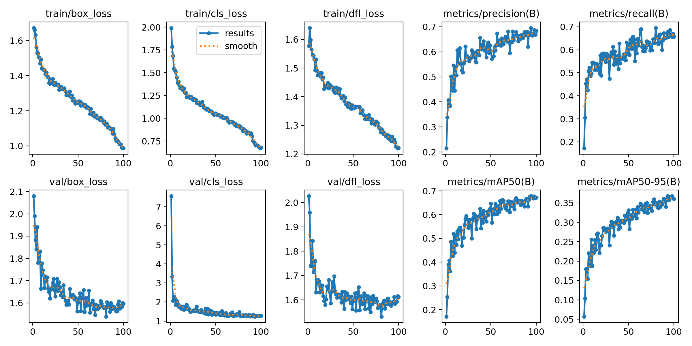
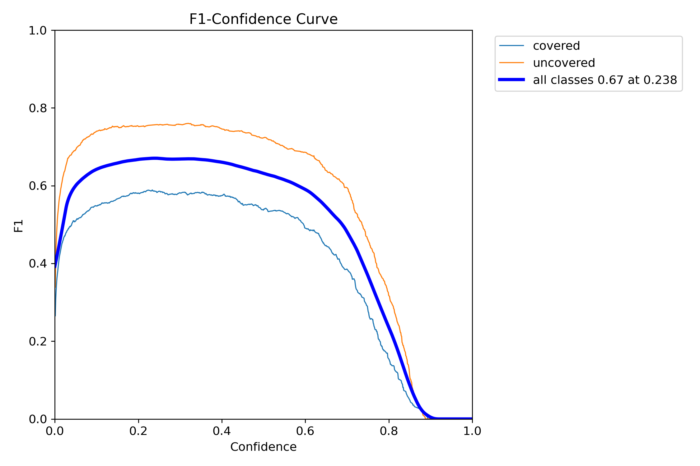
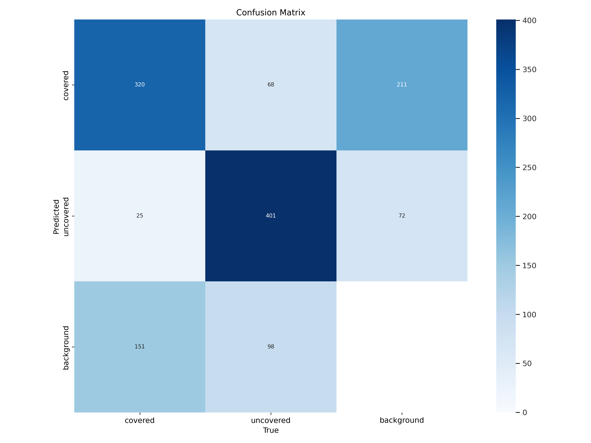
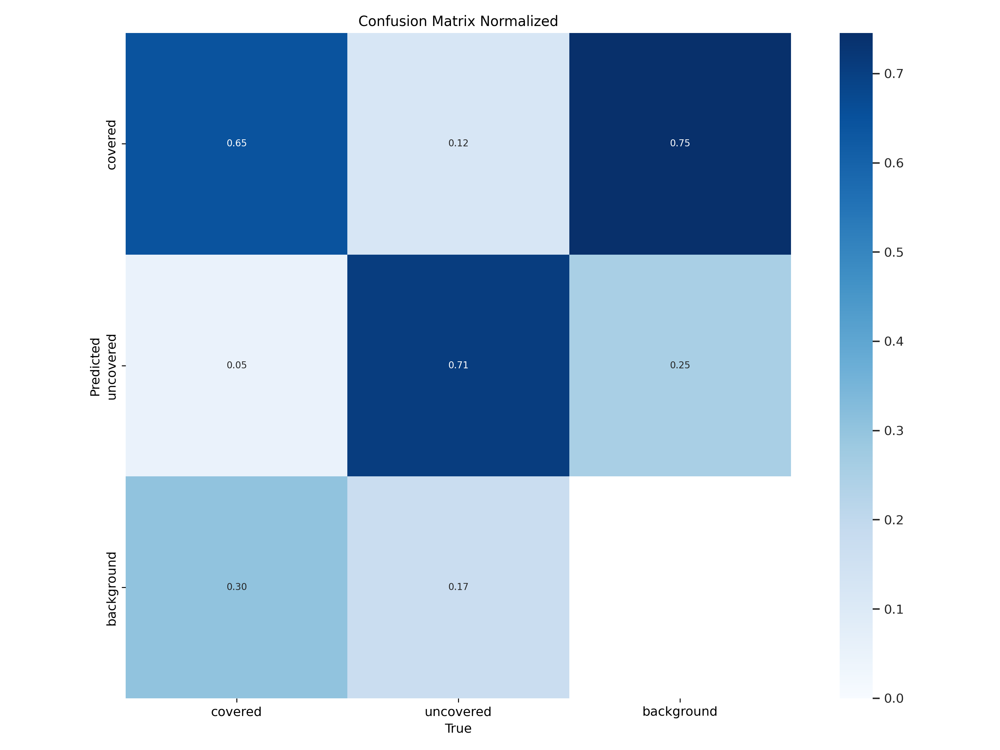
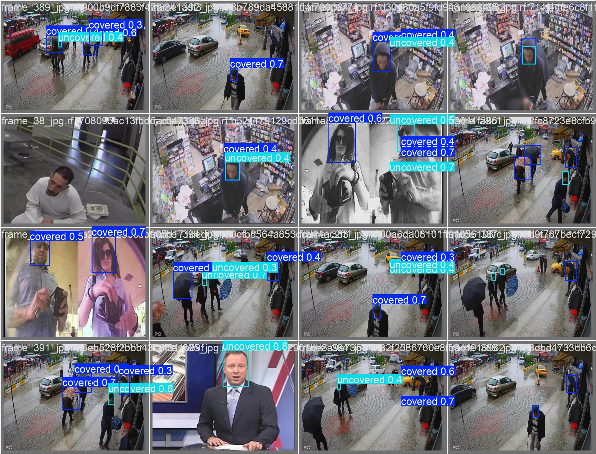
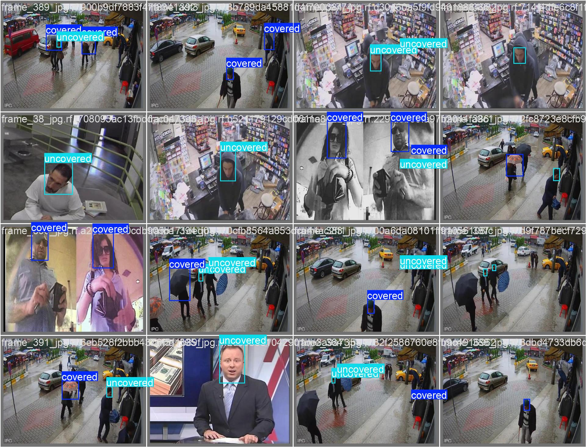

# 👁️ Face Covered vs Uncovered Detection using YOLO

This project uses a custom-trained **YOLO model** to detect whether a person’s face is **uncovered (clearly visible)** or **covered** by *any* obstruction such as masks, large sunglasses, cloth, scarves, hands, hats, or other objects.  

✔ Works with **CCTV footage**, **webcams**, and **videos**  
✔ Real-time detection supported  
✔ Useful for **security**, **ATMs**, **restricted areas**, and **access control systems**

---

# 📌 Problem Definition

In security-sensitive environments (ATMs, offices, gates), **faces must remain visible**.  
This model classifies:

- **covered** — face is fully or partially obstructed  
- **uncovered** — face is clearly visible  

If the full face is **not** visible to the camera, the system considers it **covered**.

---

# 📂 Dataset

- **3,000+ manually annotated images**
- Captured in **diverse environments**:
  - rain, daylight, indoor/outdoor, CCTV angles, kiosks, shops, etc.
- Annotation done using **YOLO format**
- **Three classes in annotations:**
  - `covered`
  - `uncovered`
  - `background` (faces/people not relevant to classification)

Dataset includes challenging cases:
- Sunglasses  
- Cloth masks  
- Phone blocking the face  
- Hoodies, caps  
- Low-light CCTV frames  

---

# 🛠️ Training Details

- **Model:** YOLO  
- **Epochs:** 100  
- **Image size:** 640×640  
- **Batch size:** 16  
- **Optimizer:** ADAM    
- **Training notebook:** `train_model.ipynb`
- **Final weights:** `best.pt`

---

# 🏆 Model Performance (Excellent Results)

Your model shows **strong accuracy**, **high F1**, and **stable precision/recall** across both classes.

## ✔ Key Metrics

| Metric | Value |
|--------|-------|
| **mAP@50** | ~0.67 |
| **mAP@50-95** | ~0.35 |
| **Peak F1 Score** | **0.67 at confidence 0.238** |
| **Precision (high confidence)** | up to ~1.00 |
| **Recall (low confidence)** | up to ~0.91 |

### 🔍 Interpretation
- **Uncovered faces** are detected extremely accurately (normalized matrix shows ~0.71).  
- **Covered faces** also have strong detection performance (~0.65).  
- **Background class** is handled reasonably well, typical for CCTV datasets.

---

# 📊 Training & Validation Metrics

Below is the combined training performance:

### **📈 Training/Validation Loss & Accuracy Curves**


These illustrate:
- Smooth downward loss trend
- Strong improvement in precision & recall
- Increasing mAP values across epochs

---

# 📈 F1-Confidence Curve

Peak F1 of **0.67 at 0.238 confidence** shows high stability and balance.



---

# 🔢 Confusion Matrices

## **Confusion Matrix (Counts)**


### Interpretation (Counts)
- True *uncovered*: **401** correctly detected  
- True *covered*: **320** correctly detected  
- *background* class handled with expected variance  

## **Normalized Confusion Matrix**


### Interpretation (Normalized)
- Covered → predicted covered: **65%**
- Uncovered → predicted uncovered: **71%**
- Background handled at ~75% accuracy  
- Very low misclassification between covered ↔ uncovered

👉 **These are strong numbers for real-world surveillance footage.**

---

# ▶️ Run the Model (Inference)

Use the provided `test.py` file to run webcam or video detection.

### **Webcam or Video Detection**
```bash
python test.py
```

---

## 📸 Example Detection Results

Below are example output frames showing how the model detects **covered** and **uncovered** faces.  
Displayed **side by side** for easy visual comparison.

<p align="center">
  
  &nbsp;&nbsp;
  
</p>

**Left:** Model predictions  
**Right:** Ground-truth labeled image  

These examples demonstrate the model’s ability to handle varied lighting, angles, and facial obstructions.


